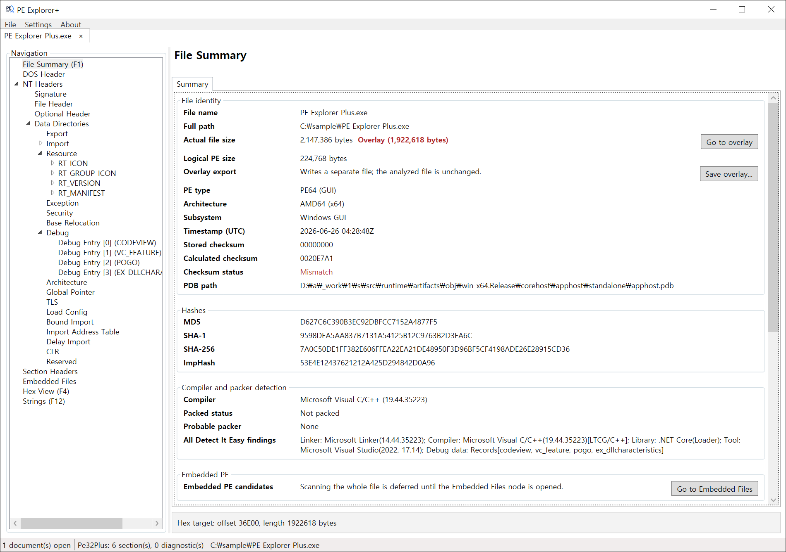
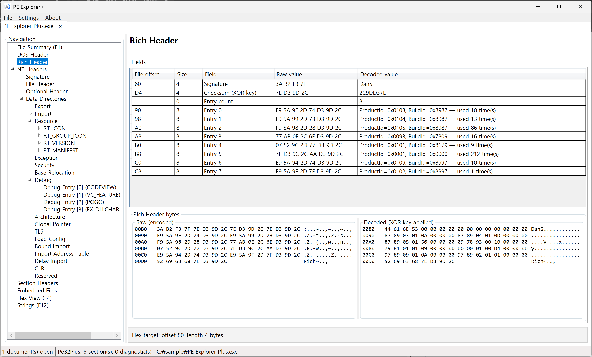
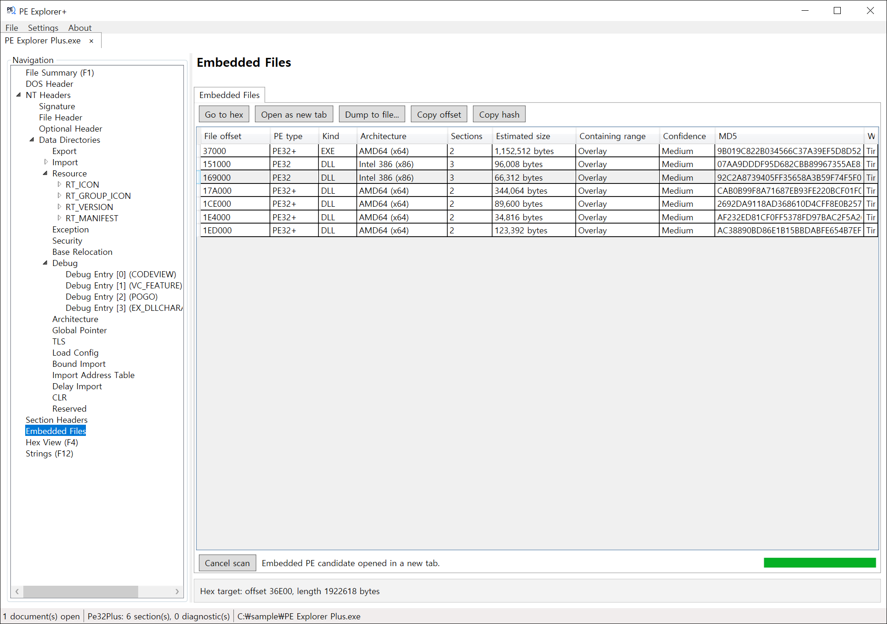
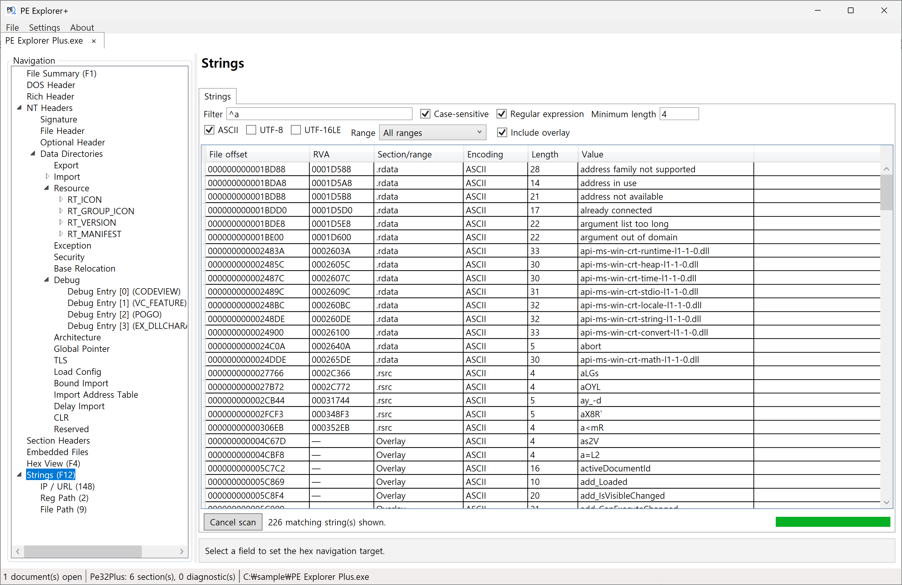
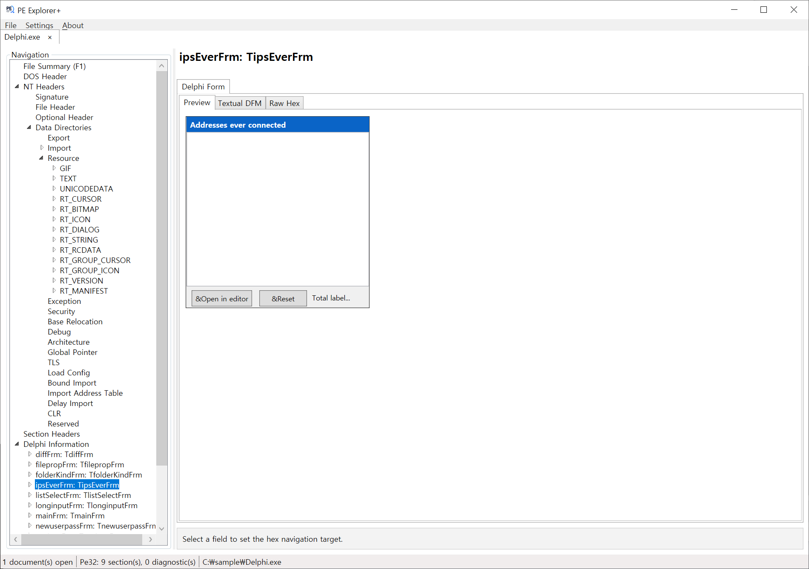
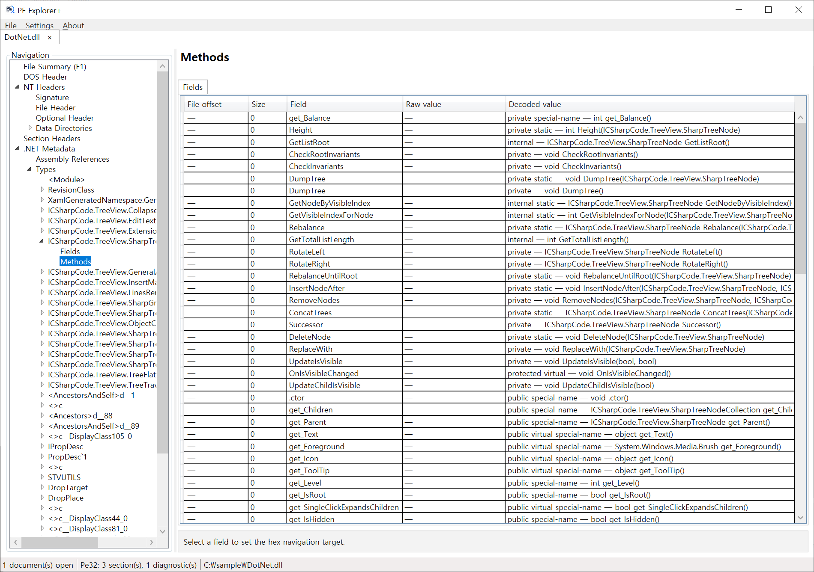
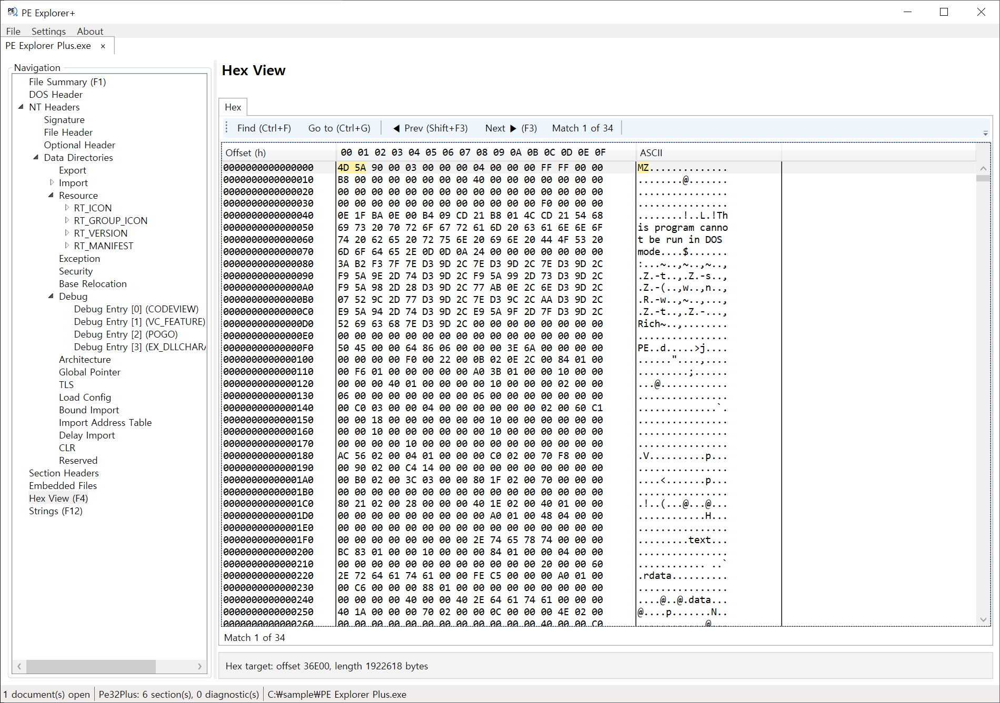
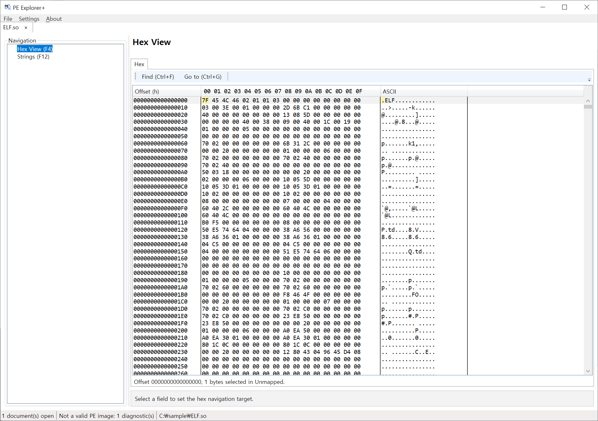
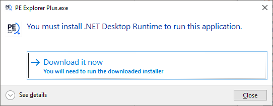

  

# PE Explorer+

  
  
  
  

> A modern PE static analysis tool for reverse engineers, malware analysts, and security researchers.

PE Explorer+ helps you quickly inspect, understand, and analyze Portable Executable (PE) files through a modern and intuitive interface.

---

## Why PE Explorer+?

PE Explorer+ is designed to simplify PE analysis without sacrificing the information security researchers need.

Instead of relying on multiple utilities, PE Explorer+ brings common PE analysis workflows into a single application.

It combines essential PE inspection features with compiler identification, embedded executable detection, digital signature verification, .NET metadata inspection, UPX unpacking, and an advanced strings viewer in a clean and responsive interface.

---

## ✨ What's New (v1.1.0)

- Rich Header Analysis
  -> Detect and analyze Rich Header structures with raw and decoded hex views.

---

## Features

* PE structure analysis (PE32 / PE32+)
* Compiler and packer identification (powered by Detect It Easy)
* Embedded PE detection and dumping
* Digital signature verification
* UPX unpacking
* Advanced Strings Viewer
* Resource Viewer
* .NET Metadata Viewer

---

## Screenshots

### Rich Header Analysis

Parse Rich Header structures and display raw and decoded hex data.

### Embedded PE Detection & Dumping

Detect embedded PE files inside executables and extract them with a single click.

---

### Advanced Strings Viewer

Browse ASCII and Unicode strings with filtering and search capabilities.

---

### Resource Viewer

Inspect executable resources including icons, dialogs, menus, bitmaps, and Delphi forms.

---

### .NET Metadata Viewer

Explore .NET metadata tables, streams, and assembly information.

---

### Hex View

Examine file contents with a built-in hexadecimal viewer.

---

### Non-PE Viewer

Even for non-PE files, Hex View and Strings Viewer remain available for quick inspection.

---

## Quick Demo

See PE Explorer+ in action.

https://github.com/user-attachments/assets/66601c14-56cb-425b-a0ab-17f6b1c03769

---

## Requirements

PE Explorer+ requires the **Microsoft .NET 10 Desktop Runtime**.

If the runtime is not installed, Windows will prompt you to install it before launching **PE Explorer Plus.exe**.

---

## Security Notice

PE Explorer+ performs static analysis and **does not intentionally execute** the analyzed file.

However, untrusted files should still be handled in an isolated environment.

---

## Download

Download the latest version from the **GitHub Releases** page.

The release package contains:

* PE Explorer Plus.exe
* LICENSE.txt
* THIRD_PARTY_NOTICES.md
* CHANGELOG.md

---

## Third-Party Components

PE Explorer+ includes or integrates the following third-party software:

* Detect It Easy (MIT License)
* UPX (GPL v2 with the UPX Special Exception)

For more information, see **THIRD_PARTY_NOTICES.md**.

---

## License

PE Explorer+ is **free** to use for personal, educational, research, and internal business purposes.

See **LICENSE.txt** for details.

---

## Support

If PE Explorer+ has been useful in your work, you can support its development.

