# DOCX Malware Analysis with PE Explorer+

DOCX was introduced with Microsoft Office 2007 and is based on the **OOXML (Office Open XML)** standard, which combines XML-based document structures with ZIP compression.

Compared to the legacy `.doc` format, DOCX offers smaller file sizes, improved security, and better data recovery capabilities. It is now the default document format used by Microsoft Office.

In this tutorial, we will analyze four **in-the-wild** malicious samples using PE Explorer+.

* Case 1: Macro
* Case 2: External - attachedTemplate
* Case 3: External - image & hyperlink
* Case 4: Macro & ActiveX

---

## Case 1: Macro

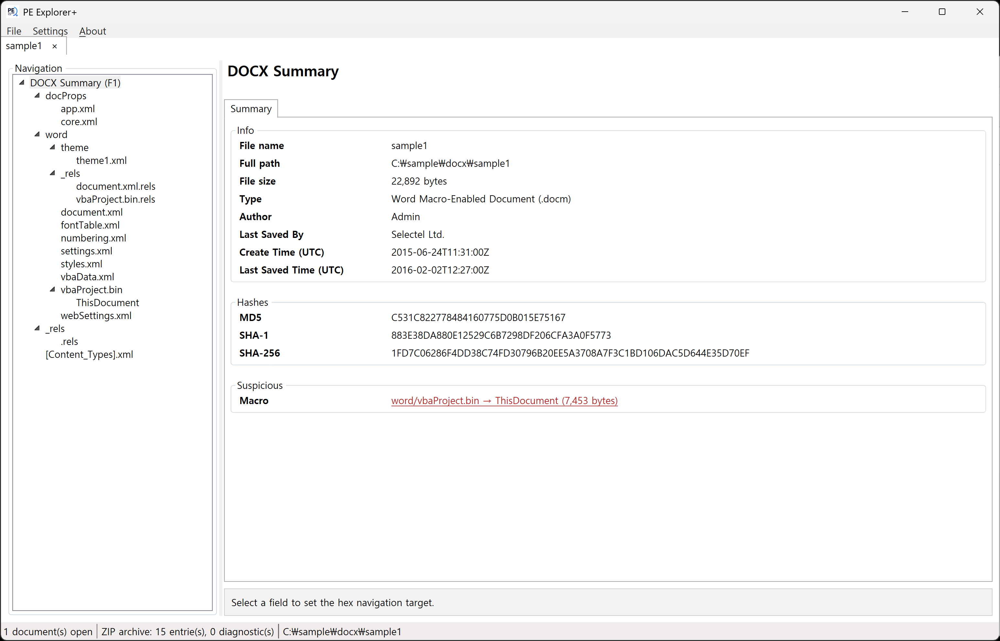

Strictly speaking, the first sample is not a DOCX file, but a `DOCM` file.

Since Microsoft Office 2007, documents containing VBA macros are required to use the DOCM format. The `Info - Type` field indicates that this is a macro-enabled document.

Now, let's click the 7 KB macro listed under **Suspicious**.

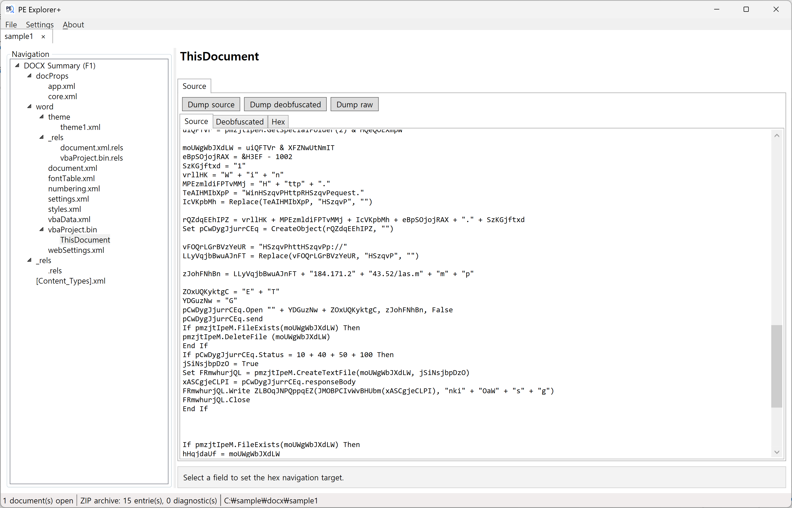

At first glance, the obfuscated code already looks suspicious.

Let's switch to the **Deobfuscated** tab.

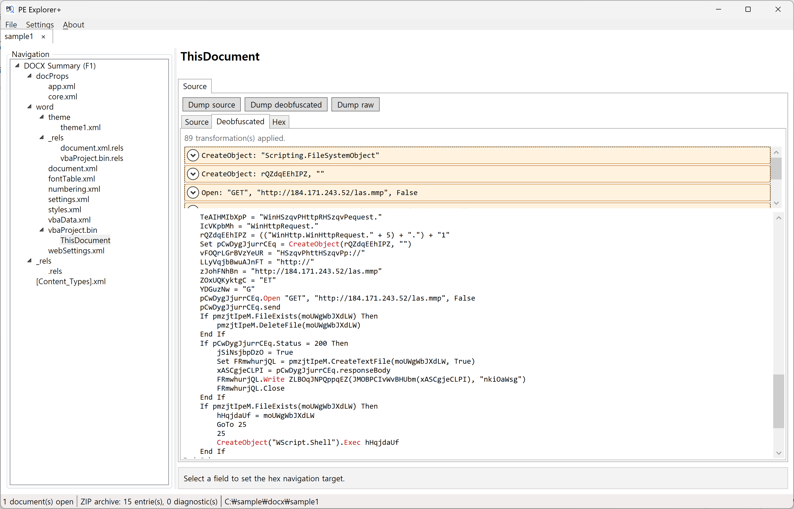

The deobfuscated code immediately reveals its behavior: it downloads a file from a remote location, saves it to the local system, and then executes it.
That's it. ;)

---

## Case 2: External - attachedTemplate

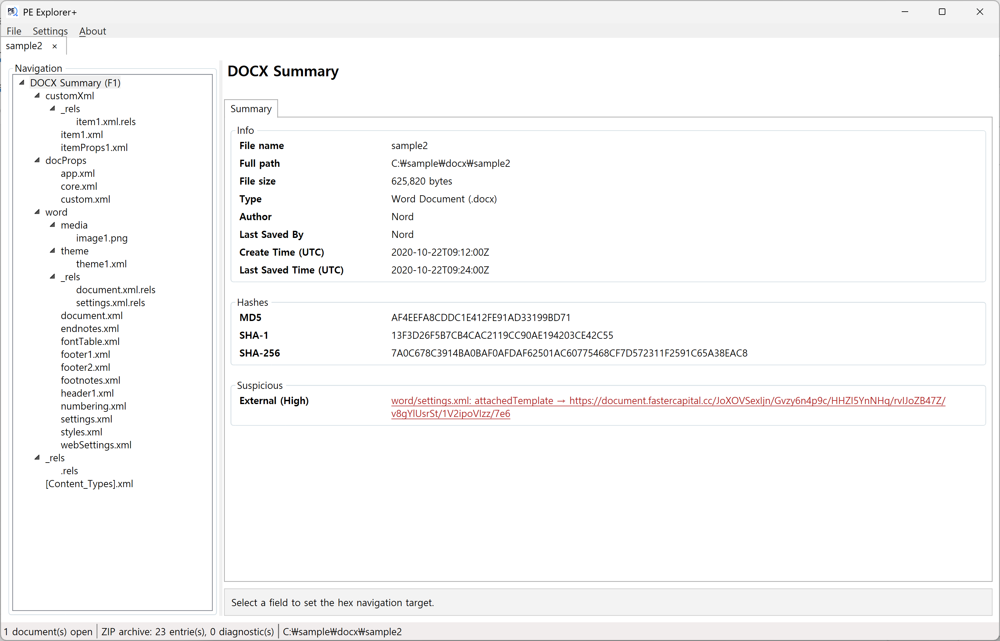

The second sample demonstrates one of the common techniques used in malicious DOCX documents.

When the document is opened, it is configured to automatically retrieve a remote template without requiring user interaction. The malicious content is hosted inside the remote template rather than embedded directly in the original document.

As a result, the DOCX file itself may not contain the actual malicious payload.

Let's click the **Suspicious** item.

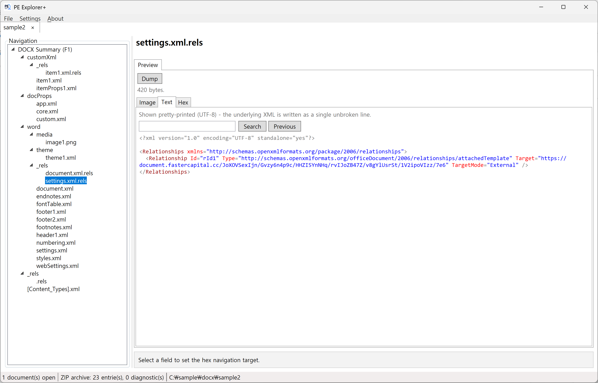

We can see that `settings.xml.rels` contains a relationship configured to load a template from an external location.

DOCX files contain relationship files that define how individual resources within the OOXML package are connected. Therefore, when analyzing DOCX files, it is important to inspect not only the document content itself, but also the associated relationship files for suspicious external references.

---

## Case 3: External - image & hyperlink

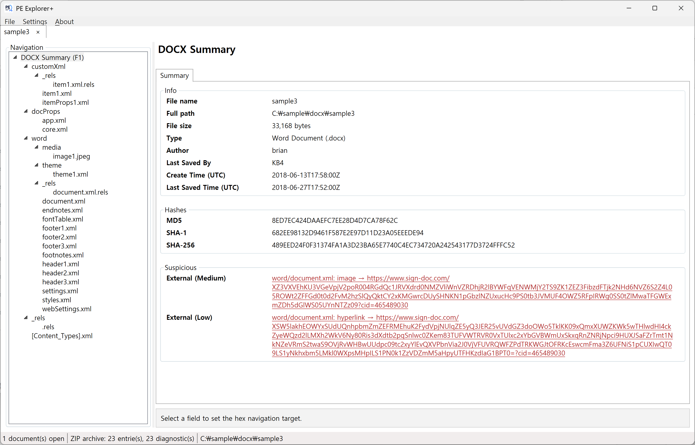

The third sample contains two **External** indicators, classified as **Medium** and **Low** severity.

The **Medium**-severity `image` automatically retrieves an image from a remote location when the document is opened. This behavior can be used as a tracking mechanism, allowing an attacker to determine whether the document has been opened without the user's knowledge.

The **Low**-severity `hyperlink`, on the other hand, requires the user to click a link embedded in the document. The link can then direct the user to a remote location or initiate the retrieval of a remote file.

This differs from `attachedTemplate`, where the remote resource can be retrieved automatically without requiring the user to click a link.

Let's click the **Suspicious** item.

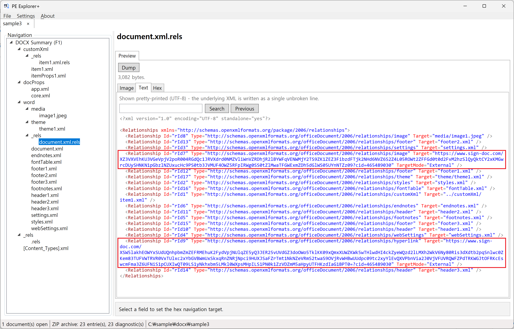

We can inspect each external relationship defined in `document.xml.rels`.

---

## Case 4: Macro & ActiveX

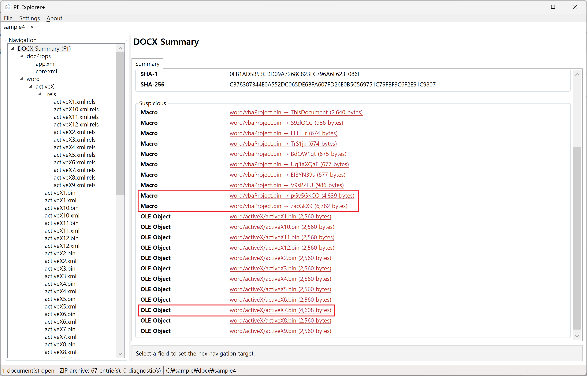

The final sample contains multiple macros and OLE objects.

The relatively large items highlighted with red boxes contain the core malicious components of the document.

As an example, let's first click:

`word/vbaProject.bin → pGv5GKCO (4,839 bytes)`

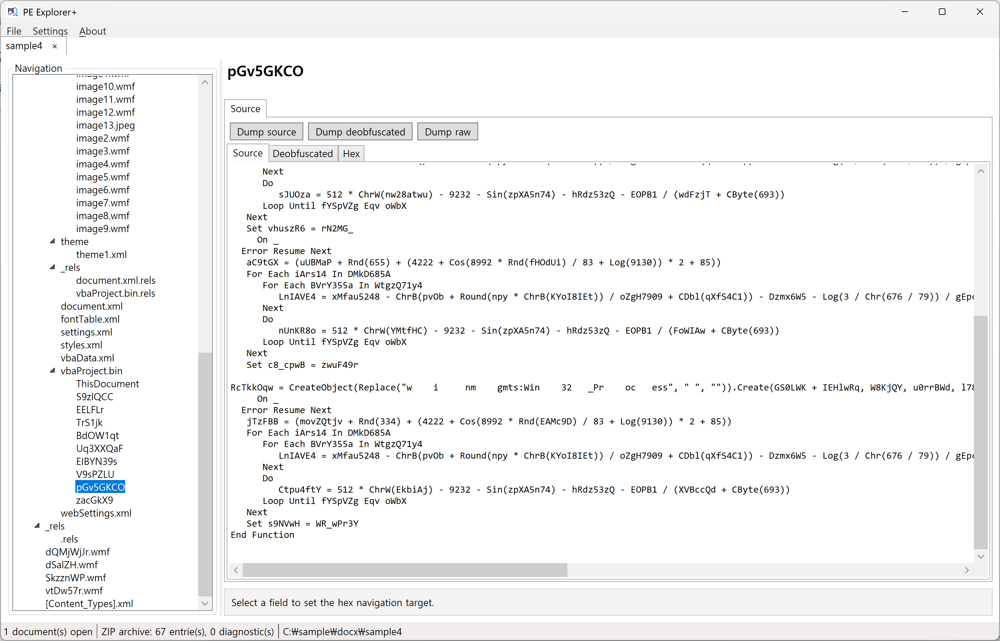

The macro contains heavily obfuscated script code.

Let's switch to the **Deobfuscated** tab.

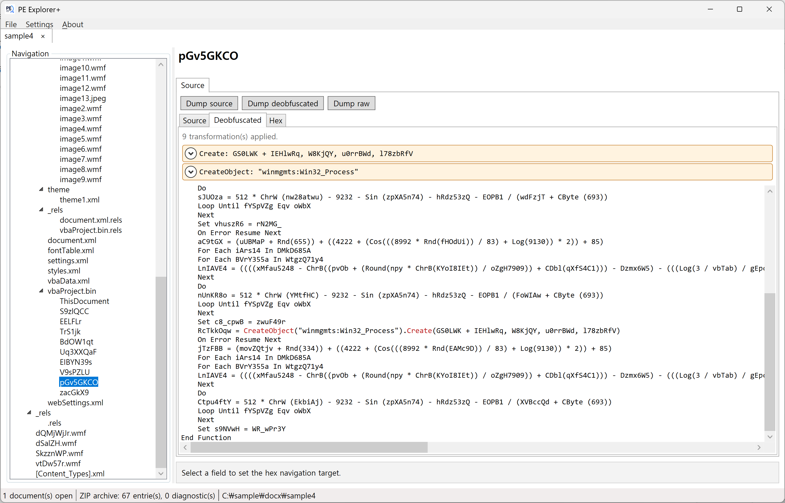

Although much of the obfuscation remains, we can immediately identify code that attempts to create a process.

However, the more interesting component is not the macro, but the **ActiveX object**.

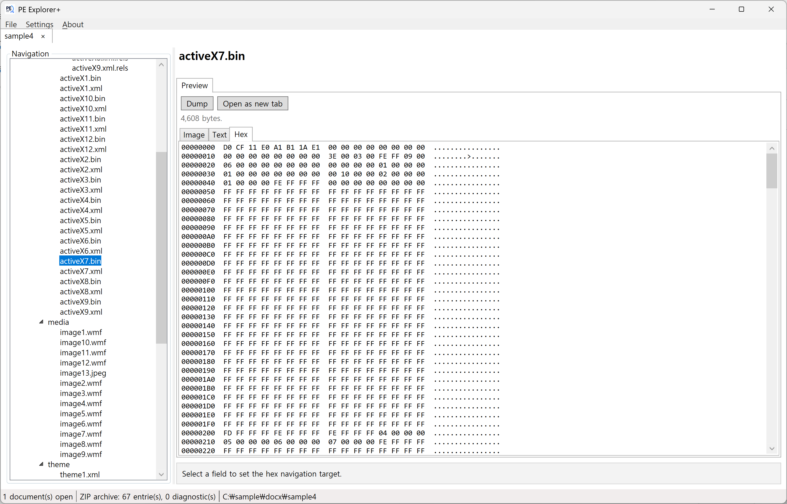

This is the OLE object highlighted earlier:

`word/activeX/activeX7.bin (4,608 bytes)`

Click **Open as new tab** to load the object for further analysis.

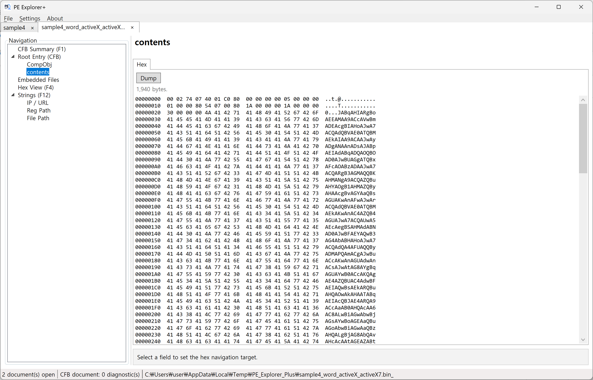

Inside the `contents` stream, we can identify a string that appears to contain encoded data.

Let's use CyberChef to reveal the hidden code.

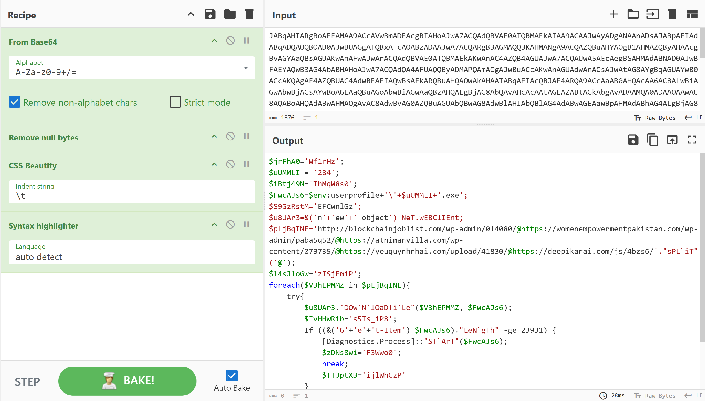

After decoding the data, we can confirm that the hidden content is **PowerShell code**.

> **Note:** CyberChef does not provide a dedicated `PowerShell Beautify` operation, so `CSS Beautify` was temporarily used to improve readability.

As you can see, the PowerShell code attempts to download additional payloads sequentially from multiple remote locations and execute them.

---

## Conclusion

In this tutorial, we analyzed four **real-world malicious DOCX/DOCM samples** using PE Explorer+.

PE Explorer+ helps analysts quickly identify suspicious components across several common DOCX attack vectors, making it easier to locate potentially malicious content and understand its behavior without manually inspecting every component of the OOXML package.

Because Microsoft Office documents are used worldwide, attackers continue to develop and distribute increasingly sophisticated malicious documents using a variety of techniques.

We hope PE Explorer+ can make analyzing and responding to these threats a little easier. ;)
